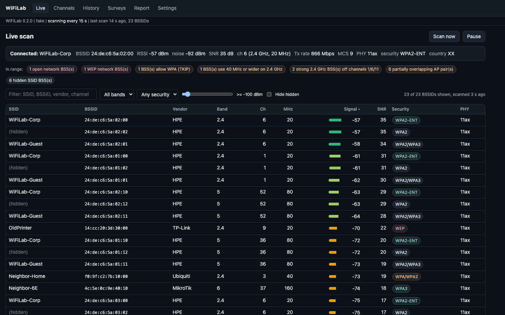
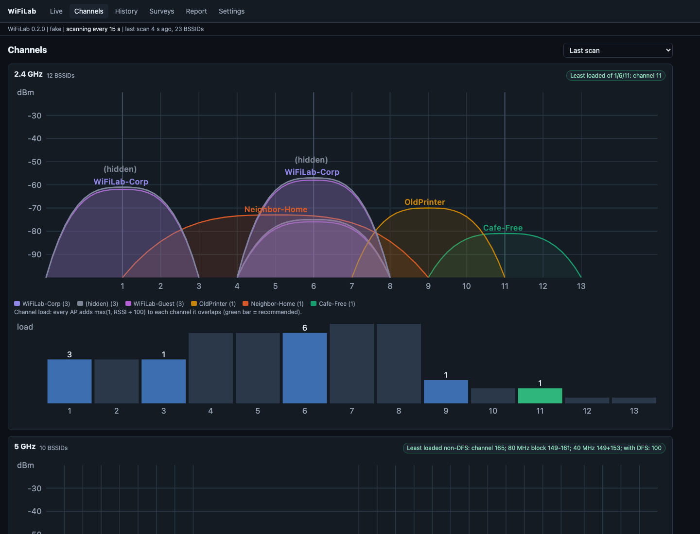
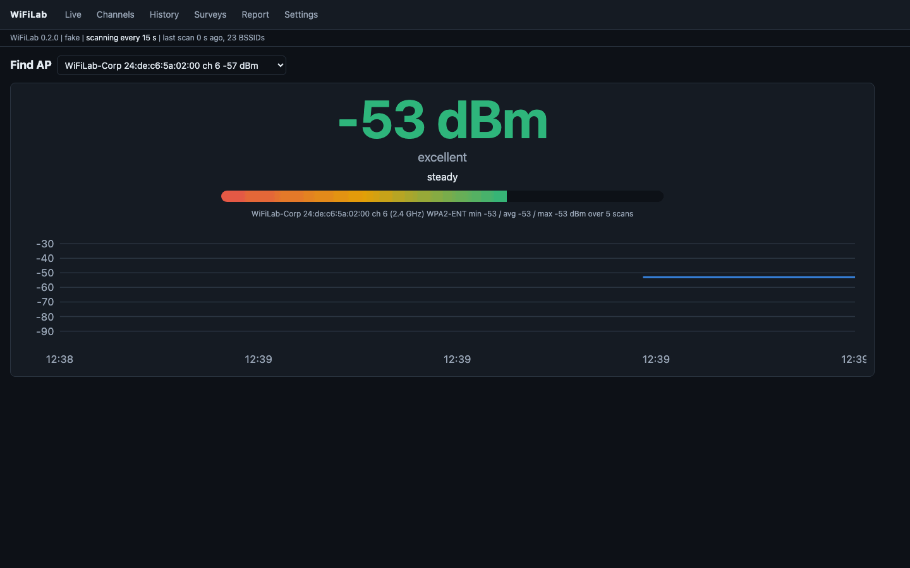
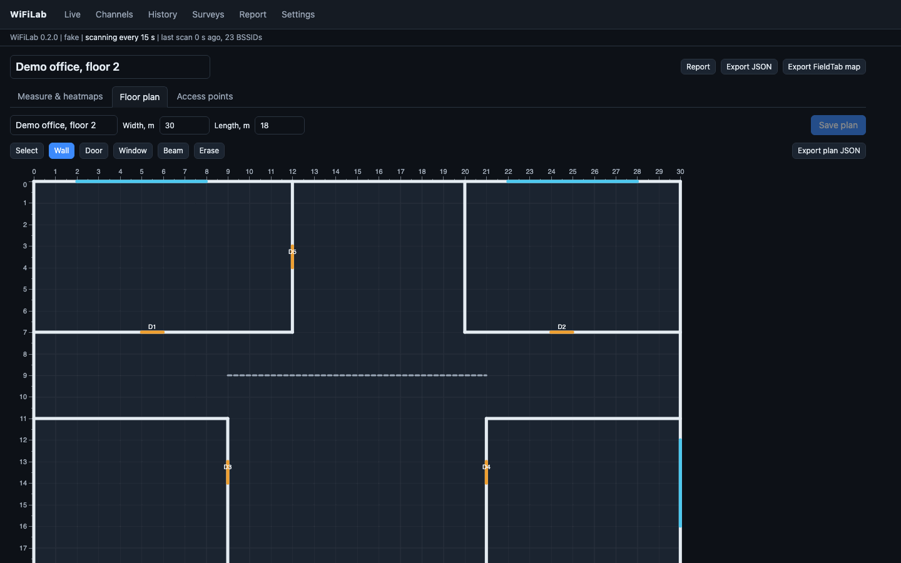
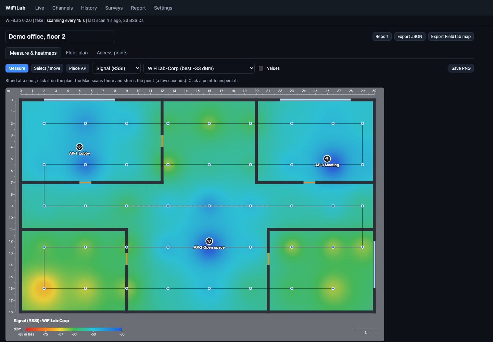
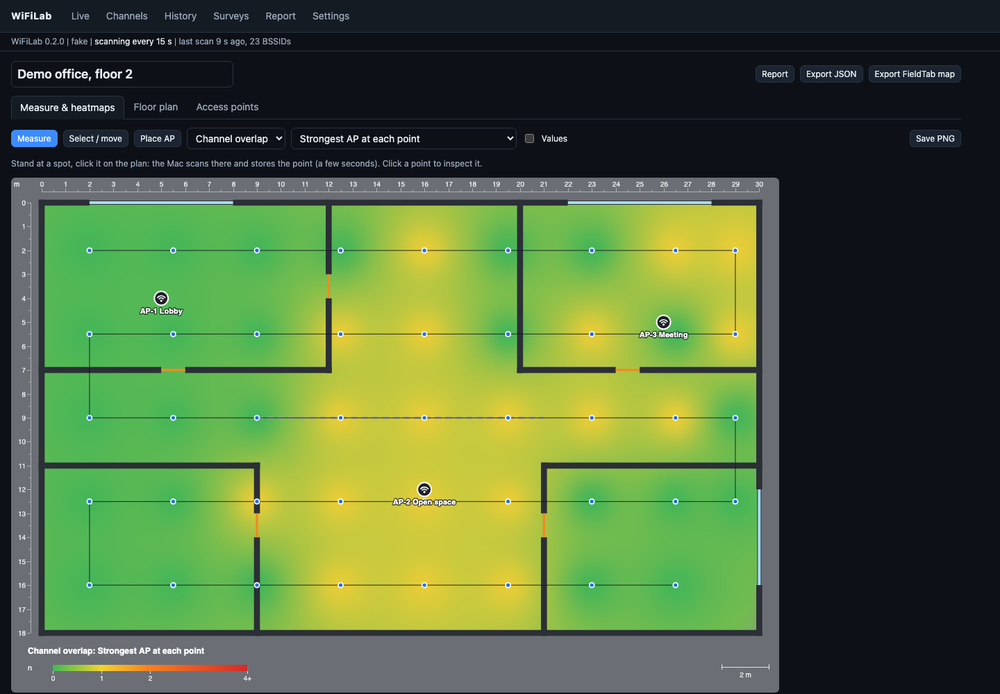
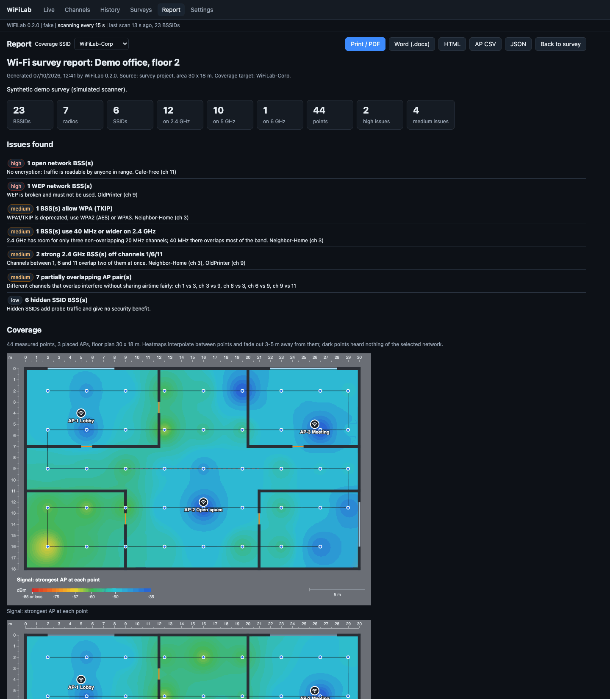

# WiFiLab

Wi-Fi scanner, site survey and reporting tool for macOS. WiFiLab scans with the Mac's own Wi-Fi radio
(CoreWLAN), keeps a scan history, draws channel graphs, finds access points by signal, builds coverage heatmaps
over a floor plan from points you measure by walking around with the Mac, and writes survey reports
(printable HTML/PDF, Word, CSV, JSON).

It is a standalone fork of the Wi-Fi features of FieldTab (a field engineer tablet and its Mac companion): the
analysis logic, the engineering heatmaps and the `fieldtab.plan/1` floor plan format are shared, and FieldTab tablet
survey exports open in WiFiLab directly.

The UI is a local web app on `127.0.0.1` (a random free port, opened in your browser), started from a small menubar
app (`WiFiLab.app`).

## Features

- **Scanner** (CoreWLAN via pyobjc): SSID, BSSID, RSSI, noise, channel, band (2.4 / 5 / 6 GHz), channel width,
  security (Open, OWE, WEP, WPA, WPA2, WPA3, Enterprise, transition modes), PHY modes (11a/b/g/n/ac/ax/be), country,
  beacon interval, ad hoc networks; current connection with Tx rate, SNR and MCS.
- **Background scanning** with a configurable interval and a scan history in SQLite
  (`~/Library/Application Support/WiFiLab`), pruned after 14 days by default. Clear errors when Wi-Fi is off or the
  radio is busy (falls back to the system's cached scan).
- **Live AP table** with search, band / security / signal filters, sortable columns, vendor by MAC prefix, per-AP
  details and a signal-over-time chart.
- **Vendor database**: the full public IEEE registries (MA-L, MA-M and MA-S, about 54,000 prefixes, longest-prefix
  match) bundled with the app and updatable from Settings > Update vendor database. Randomized (locally
  administered) BSSIDs are shown as "Private (randomized)"; your own names in `<data dir>/oui.csv` win.
- **Channel graphs** for 2.4, 5 and 6 GHz: every AP as an arc over the channels it really occupies (40/80/160 MHz
  blocks), coloured per SSID; channel load bars; recommendations (least loaded of 1/6/11, best non-DFS 20/40/80 MHz
  on 5 GHz, best PSC channel on 6 GHz); co-channel congestion and partially overlapping pairs.
- **Find AP**: a big RSSI meter with trend and min/avg/max while you walk.
- **History**: every BSSID seen in a window with min/avg/max, and signal curves for up to 8 APs.
- **Surveys**: a floor plan per survey (editor with walls, doors, windows, beams, snapping, undo, background image;
  JSON import; an LLM prompt that turns a photo of a plan into the JSON). Click where you stand: the Mac scans and
  stores the point. Place access points on the plan and bind them to the measured radios.
- **Engineering heatmaps** (inverse-distance weighting with fade-out): signal of the strongest AP, one SSID, one AP,
  an AP group; serving AP zones; SNR; AP count; channel overlap. PNG export.
- **Reports**: every report of a survey with measured points carries its heatmaps (strongest AP, target SSID, SNR,
  AP count, channel overlap, serving zones and each placed AP) over the floor plan with legend and scale, in the
  browser, in the standalone HTML and in Word (rendered on the server when the browser does not send them); the live
  report shows the latest survey with points. Plus summary, issues found (weak and missing coverage, low SNR, co-channel congestion, partial overlap,
  open / WEP / WPA1 networks, hidden SSIDs, 40 MHz and off-1/6/11 channels on 2.4 GHz), heatmaps, channel plan and AP
  inventory. Print to PDF from the browser, Word (.docx), CSV and JSON.
- **FieldTab import**: tablet `wifi-survey` JSON/CSV, `wifi-map` JSON (metre maps and older cell grids), session
  documents and `fieldtab.plan/1` plans; export back to the FieldTab map format.
- **Fake scanner** (a simulated floor) for tests, demos and non-macOS hosts.

## Screenshots

All screenshots use the built-in simulated scanner (`WIFILAB_SCANNER=fake`): every network name and address in them
is made up.

| | |
|---|---|
|  Live AP table with the connection card and quick issues |  Channel graphs and load bars |
|  Find AP: RSSI meter while walking |  Floor plan editor |
|  Survey heatmap: signal of one SSID, placed APs |  Channel overlap heatmap |
|  Report with issues and coverage heatmaps | |

## Requirements

- macOS 13 or newer (developed on macOS 26/27, Apple Silicon); Python 3.11+ (3.12 recommended).
- Xcode Command Line Tools (`clang`, `codesign`, `iconutil`) to build the app bundle.
- Node.js only to run the JavaScript unit tests.

## Install and run

Build the menubar app (creates `~/.venvs/wifilab` if missing, installs WiFiLab there, builds
`/Applications/WiFiLab.app`):

```bash
git clone https://github.com/igrbtn/WiFiLab.git
cd WiFiLab
./scripts/build_app.sh
open /Applications/WiFiLab.app
```

The app sits in the menu bar as "WL", opens the UI in your browser and asks for Location Services (see below).
Log: `~/Library/Logs/WiFiLab.log`.

From source, without the bundle:

```bash
python3 -m venv .venv && . .venv/bin/activate
pip install -e ".[dev]"            # or: pip install ".[dev]"
wifilab web                        # UI only, on a random free port (printed in the log)
wifilab web --port 8197            # or a fixed port (also WIFILAB_PORT)
wifilab url                        # URL of the running instance
wifilab scan                       # one scan printed in the terminal
WIFILAB_SCANNER=fake wifilab web   # simulated floor, works anywhere
```

Configuration is optional, through environment variables (see `.env.example`): port, data folder, scanner backend,
scan interval, history retention.

The server listens on `127.0.0.1` only, on a free port picked at start unless `--port` or `WIFILAB_PORT` fixes one.
The running URL is written to `server.json` in the data folder (removed on exit); starting WiFiLab again while it runs
just opens the running instance.

## Location Services permission

Since macOS 14, Wi-Fi scans return network names (SSID) and access point addresses (BSSID) only to apps the user
allowed Location Services. Without it every network comes back anonymous: WiFiLab counts them and shows a banner
explaining what to do.

- `WiFiLab.app` declares `NSLocationWhenInUseUsageDescription` and asks at start (or from the menu, "Allow Location
  Services..."). Allow it once in the prompt or in System Settings > Privacy & Security > Location Services.
- When you run `wifilab web` from a terminal, macOS judges the terminal app, which usually has no location access,
  so scans stay anonymous. Use the app bundle for real surveys.
- WiFiLab does not read, store or send your location; the permission only unlocks the scan fields.

The app bundle is signed ad hoc. Rebuilding it with a different launcher version or plist makes macOS ask again.

## Survey workflow

1. Surveys > New survey, then Floor plan: set width and length, draw walls, doors and windows, or import a plan
   (JSON, a FieldTab plan, or an LLM answer made from a photo with the provided prompt). Optionally add a background
   image.
2. Measure & heatmaps: stand at a spot, click the same spot on the plan. The Mac scans (a few seconds) and the
   point appears. Repeat in a walking pattern, roughly every 2-4 m.
3. Place AP: click where an access point hangs and pick the measured radio it is. This enables the serving AP and
   per-AP views.
4. Report: choose the SSID the coverage is judged for, then Print / PDF, Word, HTML, CSV or JSON.

A practical walk-through for a real walking survey (plan, scale, point spacing, timing, AP placement, reading the
maps): [docs/SURVEY_GUIDE.md](docs/SURVEY_GUIDE.md).

## Development

```bash
pip install -e ".[dev]"
pytest                 # Python tests + node tests of the browser helpers (skipped without node)
ruff check .
```

Layout: `src/wifilab/` (FastAPI app `web.py`, `scanner/` backends, `analysis.py`, `store.py`, `projects.py`,
`report.py`, `fieldtab.py` import), `src/wifilab/static/` (vanilla JS UI, no build step), `tests/`,
`scripts/build_app.sh` (app bundle). Floor plan format: [docs/PLAN_FORMAT.md](docs/PLAN_FORMAT.md).

## Data sources

Vendor names come from the IEEE Registration Authority's public MAC address registries (MA-L `oui.csv`, MA-M
`mam.csv`, MA-S `oui36.csv` from standards-oui.ieee.org), compacted to ASCII short names by
`scripts/update_oui.py`, which also refreshes the bundled `src/wifilab/data/oui.tsv.gz`.

## License

MIT, see [LICENSE](LICENSE). Copyright (c) 2026 Igor Batin.
